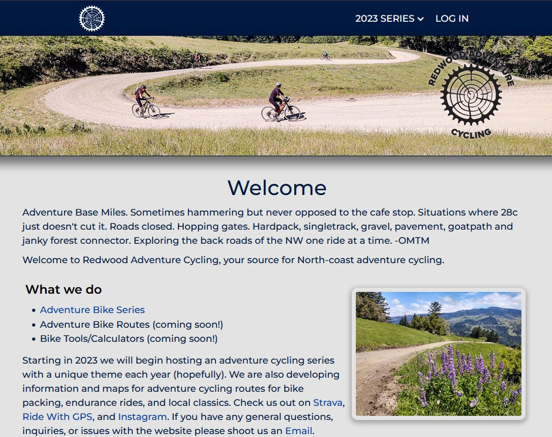

# Redwood Adventure Cycling

## Description
Redwood Adventure Cycling is a project for a website promoting adventure cycling in and around Humboldt County, California. Participants can ride each of the routes at their leisure, then submit their ride through the website using their Strava account activity. Once the ride is verified it counts for a completion toward the series and is shown in the full participant leaderboard. Participants who finish the series first, and those with the most points at the end of the series win great prizes.

This site requires an account at [Strava.com](https://www.strava.com) in order to login, record, and verify the rides. Strava has a premium option, however a standard free subscription is enough for user participation. This site utilizes Strava OAuth2 authentication to access the V3 API to user's data such as their profile and activity data.

The site also uses [Ridewithgps.com](https://ridewithgps.com) to create the adventure series routes and uses their API to pull in route information into the route database including route name, mileage, elevation, and description. It creates points and difficulty based on the route information pulled in from the API used for the adventure series point system. 

## Usage
Navigate to the project link here: https://redwoodadventurecycling.com/

## API Documentation
- To access bike routes api data, navigate to /api/bikeroutes

## Installation Requirements
This website application requires a Strava account and the creation of a Strava API Application which provides the necessary client id and secret to run. Information on the Strava API can be found [here](http://developers.strava.com/docs/reference/). The next steps include:

1. Clone this repository
2. Run "npm install"
3. Create a .env file which includes:
  - mysql database name
  - mysql environment variables
  - strava api client id
  - strava api client secret
  - Ridewithgps auth key
  - Ridewithgps api key

## NPM Packages
* [connect-ensure-login](https://www.npmjs.com/package/connect-ensure-login)
* [connect-session-sequelize](https://www.npmjs.com/package/connect-session-sequelize)
* [cookie-parser](https://www.npmjs.com/package/cookie-parser)
* [dotenv](https://www.npmjs.com/package/dotenv) - loads environment variables
* [express](https://expressjs.com/) - web application framework
* [express-handlebars](https://www.npmjs.com/package/express-handlebars) - Handlebars view engine
* [express-session](https://www.npmjs.com/package/express-session) - express session library
* [handlebars](https://www.npmjs.com/package/handlebars) - Node templating language
* [mysql2](https://www.npmjs.com/package/mysql2) - MySQL Node.js client
* [passport](https://www.npmjs.com/package/passport) - Node authentication middleware
* [passport-strava](https://www.npmjs.com/package/passport-strava) - Passport strategy for authenticating with Strava API V3
* [sequelize](https://www.npmjs.com/package/sequelize) - promise-based Node.js ORM
  
## Contributors
  - [Jason Barnes](https://github.com/yooperjb)
  - [Anthony Kieu](https://github.com/anthonykieu) 
  - [Calista Mayer](https://github.com/calistamayer)
  - [Danielle Branton](https://github.com/webprinc3ss)

## Credit

Icon created by <a href="https://www.freepik.com" title="Freepik">Freepik</a> from <a href="https://www.flaticon.com/" title="Flaticon">www.flaticon.com</a>

## Questions
Please contact any of the contributors if you have questions regarding the implementation of The Adventure Series. 